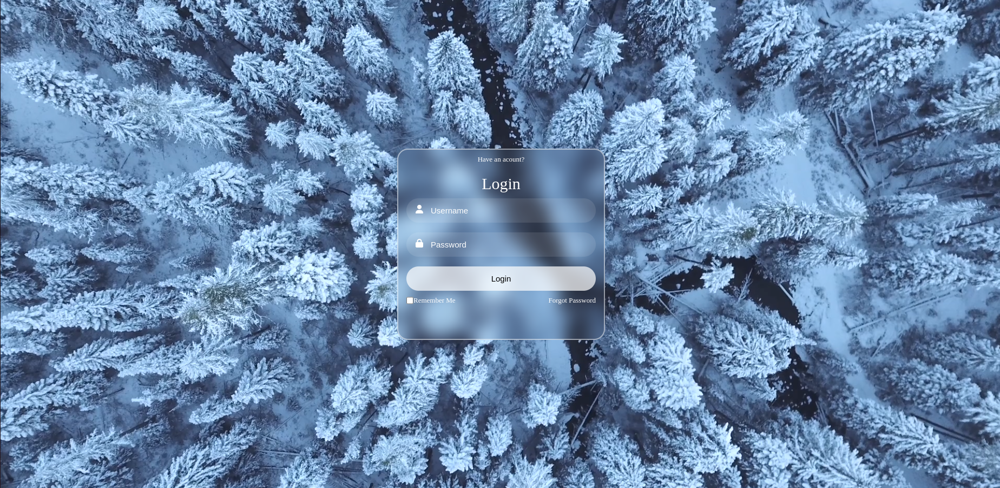

# Login Page Project

This project is a simple login page template with a video background.

## Table of Contents

- [Introduction](#introduction)
- [Features](#features)
- [Installation](#installation)
- [Usage](#usage)
- [Screenshots](#screenshots)
- [Contributing](#contributing)
- [License](#license)

## Introduction

Welcome to the Login Page Project! This project provides a stylish and responsive login page template with a video background.

## Features

- Clean and modern design
- Video background for an engaging user experience
- Input fields for username and password
- Remember Me and Forgot Password options
- Submit button for login

## Installation

1. Clone the repository: `git clone https://github.com/Kavindu95/Responsive-Login-Using-HTML5-CSS`
2. Navigate to the project directory: `cd login-page`
3. Open the `index.html` file in your web browser.
4. Host with github: 'https://kavindu95.github.io/Responsive-Login-Using-HTML5-CSS/'

## Usage

1. Open the `index.html` file in a web browser.
2. Enter your username and password.
3. Click the "Login" button.

## Screenshots

*Login with video background*

## Contributing

Contributions are welcome! If you'd like to contribute to the project, please follow these steps:

1. Fork the repository.
2. Create a new branch: `git checkout -b feature/new-feature`.
3. Make your changes and commit them: `git commit -m 'Add new feature'`.
4. Push to the branch: `git push origin feature/new-feature`.
5. Submit a pull request.

## License

This project is licensed under the [MIT License](LICENSE).
